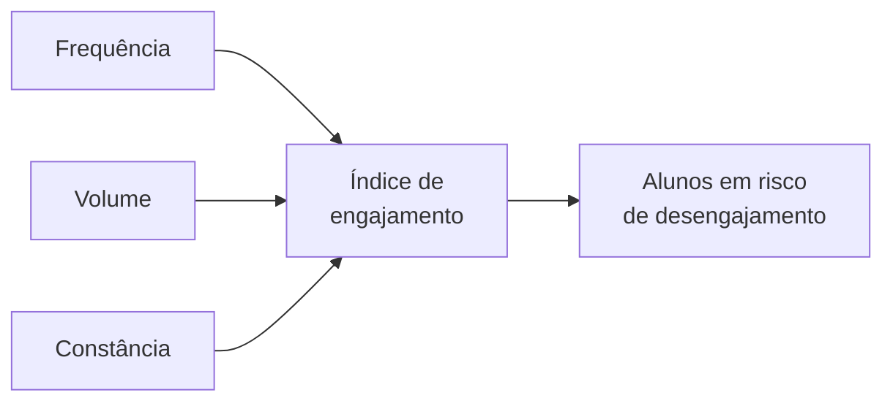

# Aula 3, Engajamento

> Esta aula trata do engajamento, talvez o sinal mais importante em Learning Analytics.
> Um aluno engajado aprende; um aluno que se afasta tende a desistir. Vamos combinar
> métricas em um índice de engajamento que resume, em um número, o envolvimento do aluno.

As métricas da aula anterior medem aspectos isolados, acurácia, volume, progresso. Mas há uma
qualidade mais ampla, que atravessa todas elas, o engajamento. Engajamento é o grau de envolvimento
do aluno com a aprendizagem, e ele é um previsor poderoso. Alunos engajados praticam, persistem e
melhoram. Alunos que se desengajam vão sumindo, e o desengajamento costuma anteceder a evasão.

Medir o engajamento é, em parte, uma arte, porque ele não é uma coisa só, mas uma combinação de
comportamentos. Quem aparece com frequência está mais engajado do que quem some por semanas. Quem
pratica muito mais do que quem mal toca no material. Quem mantém uma rotina constante mais do que
quem estuda em rajadas isoladas. Nesta aula você vai combinar esses sinais em um índice de
engajamento, um número que resume o envolvimento e ajuda a identificar quem precisa de um empurrão.

---

## Objetivos

Ao final desta aula, você deve ser capaz de:

- Explicar o que é engajamento e por que ele importa tanto.
- Identificar os comportamentos que indicam engajamento.
- Combinar métricas em um índice de engajamento.
- Usar o índice para identificar alunos em desengajamento.

## Teoria

O engajamento se manifesta em vários comportamentos, que podemos medir a partir dos eventos. A
frequência é a regularidade da presença, quantos dias o aluno esteve ativo em relação ao período. O
volume é a intensidade da prática, quantos exercícios ou interações ele teve. A constância é a
manutenção de uma rotina, como uma sequência de dias seguidos de estudo. Cada um captura uma faceta
do envolvimento.

Para resumir tudo em um número, combinamos essas facetas em um índice. A forma mais simples é uma
média ponderada, em que cada faceta entra com um peso que reflete a sua importância, depois de
normalizada para uma escala comum. O resultado é um valor entre 0 e 1, em que perto de 1 indica
alto engajamento e perto de 0 indica afastamento.



O índice não é uma verdade absoluta, é uma ferramenta. Os pesos refletem escolhas pedagógicas, e o
que conta como alto ou baixo depende do contexto. Mas, mesmo simples, um índice de engajamento é
muito útil, porque transforma vários sinais dispersos em um indicador único que dá para acompanhar e
sobre o qual dá para agir, intervindo cedo quando o engajamento cai.

## Explicação Intuitiva

Pense no engajamento como a saúde de uma planta. Não basta olhar uma coisa só, você observa a cor
das folhas, a firmeza do caule, o ritmo de crescimento. Cada sinal conta um pouco, e juntos dizem se
a planta vai bem ou precisa de cuidado. O índice de engajamento é como um boletim de saúde da
aprendizagem, que reúne os sinais em uma avaliação geral.

A grande vantagem é a antecipação. Uma planta que começa a murchar dá sinais antes de morrer, e quem
cuida pode agir a tempo. Um aluno que começa a se desengajar também dá sinais, menos frequência,
menos prática, rotina quebrada, antes de desistir. Um índice que captura esses sinais permite ao
professor agir cedo, com uma mensagem, um incentivo, uma ajuda, antes que o afastamento vire evasão.

## Explicação Matemática

O índice de engajamento é uma combinação ponderada de facetas normalizadas. Sejam $f$ a frequência,
$v$ o volume e $c$ a constância, cada um normalizado para o intervalo $[0, 1]$. O índice é

$$
\text{engajamento} = w_f \cdot f + w_v \cdot v + w_c \cdot c,
$$

com pesos não negativos que somam 1, por exemplo $w_f = 0{,}4$, $w_v = 0{,}4$ e $w_c = 0{,}2$. A
normalização é o que permite somar grandezas de naturezas diferentes. A frequência já é uma fração.
O volume e a constância são saturados, por exemplo dividindo pelo valor que consideramos suficiente
e limitando a 1, de modo que praticar muito além de um patamar não infla o índice indefinidamente.

A escolha dos pesos e dos pontos de saturação é uma decisão de projeto, guiada pelo que importa
naquele contexto. O importante é que o índice resultante seja monotônico nas facetas, mais
frequência, mais volume ou mais constância sempre aumentam o engajamento, o que o torna interpretável
e acionável.

## Exemplo Prático

Vamos calcular o índice de engajamento de alunos a partir das suas facetas, frequência, volume e
constância, e usá-lo para separar quem está engajado de quem está se afastando. A expectativa é que
um aluno ativo e constante tenha índice alto, e um aluno esporádico tenha índice baixo.

O cálculo é determinístico e roda sem o modelo. O código está no notebook
[notebooks/modulo-12/03-engajamento.ipynb](https://github.com/LucasSpinola/assistentes-educacionais-com-ia/blob/main/notebooks/modulo-12/03-engajamento.ipynb), então
abra-o ao lado para acompanhar.

## Código Comentado

```python
def score_engajamento(dias_ativos, total_dias, exercicios, sequencia_atual):
    """Combina frequência, volume e constância em um índice de 0 a 1."""
    frequencia = dias_ativos / total_dias if total_dias else 0
    volume = min(exercicios / 20, 1.0)            # satura em 20 exercícios
    constancia = min(sequencia_atual / 7, 1.0)    # satura em 7 dias seguidos
    return round(0.4 * frequencia + 0.4 * volume + 0.2 * constancia, 3)


# Facetas de alguns alunos no período (14 dias).
alunos = {
    "ana":   {"dias_ativos": 12, "exercicios": 18, "sequencia": 6},
    "bruno": {"dias_ativos": 7,  "exercicios": 10, "sequencia": 3},
    "carla": {"dias_ativos": 2,  "exercicios": 3,  "sequencia": 0},
}

print(f"{'aluno':8} {'engajamento':>12}")
for nome, d in alunos.items():
    s = score_engajamento(d["dias_ativos"], 14, d["exercicios"], d["sequencia"])
    alerta = "  <- em risco" if s < 0.4 else ""
    print(f"{nome:8} {s:>12}{alerta}")
```

Ao rodar, o índice ordena os alunos pelo engajamento. A Ana, ativa, praticante e constante, fica com
um índice alto, perto de 0,87. O Bruno, mediano, fica no meio. A Carla, esporádica, fica com um
índice baixo, abaixo do limiar, e é sinalizada como em risco de desengajamento. Esse único número,
que resume três comportamentos, é o que permite ao professor olhar uma turma inteira e enxergar, de
relance, quem está se afastando. Na próxima aula, vamos um passo além e prevemos quem tende a evadir.

## Exercícios

1) Conceitual: O que é engajamento e por que ele costuma anteceder a evasão?
2) Conceitual: Quais comportamentos indicam engajamento, e como cada um é medido?
3) Prático: Mude os pesos do índice, dando mais peso à constância, e veja como o ranking dos alunos
   muda.
4) Prático: Ajuste os pontos de saturação do volume e da constância e observe o efeito no índice.
5) Extensão: Pesquise como plataformas reais medem engajamento, por exemplo com sequências e
   notificações, e relacione com o índice desta aula.

## Projeto da Aula

Construa um monitor de engajamento de uma turma. A entrega é um programa que calcula o índice de
engajamento de vários alunos a partir das suas facetas e sinaliza os que estão abaixo de um limiar,
ordenando a turma do mais para o menos engajado.

Considere o projeto pronto quando você conseguir produzir o ranking de engajamento da turma e a
lista de alunos em risco de desengajamento, e quando escrever um parágrafo sobre como intervir com
esses alunos. Esse índice é uma das principais entradas do modelo de predição de evasão da próxima
aula, e do dashboard do projeto do módulo.

## Leituras Recomendadas

- O artigo de Siemens sobre Learning Analytics, que discute o engajamento como sinal central.
- Materiais sobre modelos de engajamento estudantil e os seus indicadores.
- Estudos sobre desengajamento e os seus sinais precoces em ambientes online.

## Referências Científicas

As referências abaixo são reais e estão registradas em
[references/referencias.bib](../../references/referencias.bib). As chaves entre
parênteses são as do BibTeX.

- Siemens, G. (2013). Learning Analytics: The Emergence of a Discipline. American Behavioral
  Scientist, 57(10), 1380-1400. (`siemens2013learning`)
- Romero, C., e Ventura, S. (2010). Educational Data Mining: A Review of the State of the Art. IEEE
  TSMC, 40(6), 601-618. (`romero2010educational`)
- Baker, R. S. J. d., e Inventado, P. S. (2014). Educational Data Mining and Learning Analytics.
  Springer. (`baker2014educational`)
