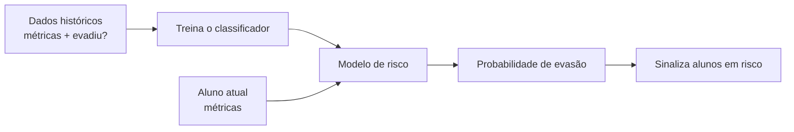

# Aula 4, Predição de evasão

> Esta aula fecha o módulo com a aplicação mais valiosa do Learning Analytics, prever
> quem está em risco de desistir, a tempo de intervir. Vamos treinar um classificador
> de evasão com as métricas que construímos, e montar o dashboard que encerra o módulo.

A evasão é o pesadelo de qualquer curso. Um aluno que desiste perde a oportunidade, e o esforço de
ensiná-lo se perde junto. O mais frustrante é que, muitas vezes, dava para evitar. O aluno deu
sinais de afastamento antes de sumir, e se alguém tivesse percebido a tempo, uma intervenção
simples, uma mensagem, uma ajuda, poderia tê-lo segurado. O problema é perceber a tempo, em uma
turma grande, quem está nesse caminho.

É aqui que o Learning Analytics entrega o seu maior valor. Com as métricas e o engajamento que
construímos, podemos treinar um modelo que aprende, a partir de dados históricos, quais padrões
antecedem a evasão, e então sinaliza, entre os alunos atuais, quem corre esse risco. Não é uma bola
de cristal, é um sinalizador que ajuda o professor a direcionar a atenção. Nesta aula você vai
treinar esse classificador, reaproveitando a regressão logística do Módulo 2, e montar o dashboard
que reúne tudo, o projeto que fecha o módulo.

---

## Objetivos

Ao final desta aula, você deve ser capaz de:

- Formular a predição de evasão como um problema de classificação.
- Treinar um classificador de evasão com as métricas de aprendizagem.
- Avaliar o modelo e interpretar os alunos sinalizados.
- Montar um dashboard que apresenta engajamento e risco.

## Teoria

Prever evasão é um problema de classificação binária, como o do Módulo 2. Cada aluno é descrito por
um conjunto de características, as métricas que calculamos, como frequência, volume, engajamento e
acurácia, e o alvo é se ele evadiu ou não. Treinamos o modelo em dados históricos de alunos cujo
desfecho já conhecemos, e ele aprende a relação entre as características e a evasão. Depois,
aplicamos o modelo aos alunos atuais para estimar o risco de cada um.



O modelo devolve uma probabilidade de evasão para cada aluno, e sinalizamos os que estão acima de um
limiar. A escolha do limiar é uma decisão prática. Um limiar baixo sinaliza muitos alunos, captura
quase todos os que vão evadir, mas inclui falsos alarmes. Um limiar alto sinaliza poucos, com mais
certeza, mas pode deixar passar alguns. Em geral, no contexto educacional, vale errar pelo lado de
sinalizar mais, porque uma intervenção desnecessária custa pouco, e deixar um aluno evadir custa
muito.

Um cuidado essencial é ético. Um sinalizador de evasão deve servir para ajudar o aluno, com apoio e
recursos, nunca para rotulá-lo ou excluí-lo. O modelo também pode carregar vieses dos dados, e
precisa ser usado com julgamento humano, como um apoio à decisão do professor, não um substituto.

## Explicação Intuitiva

Pense em um exame médico preventivo. Ele não diz com certeza que a pessoa vai adoecer, mas
identifica fatores de risco que pedem atenção, para que se aja antes. O classificador de evasão é
esse exame preventivo da aprendizagem. Olhando os sinais do aluno, ele estima o risco e chama a
atenção do professor para quem mais precisa, a tempo de cuidar.

E, como em um exame médico, o resultado é um ponto de partida, não um veredito. Um aluno sinalizado
não está condenado a evadir, ele está em um momento que pede apoio. O valor do modelo é dar foco,
em uma turma de cinquenta, ele aponta os cinco que mais precisam de um olhar, e isso muda o jogo,
porque transforma uma vigilância impossível em uma ação direcionada e viável.

## Explicação Matemática

A predição de evasão usa a regressão logística da aula de classificação. Cada aluno é um vetor de
características $\mathbf{x}$, e o modelo estima a probabilidade de evasão como

$$
P(\text{evadiu} \mid \mathbf{x}) = \sigma(\mathbf{w} \cdot \mathbf{x} + b),
$$

com $\sigma$ a sigmoide. Os pesos $\mathbf{w}$ são aprendidos minimizando a entropia cruzada sobre os
dados históricos, exatamente como no Módulo 2. Um detalhe prático importante é normalizar as
características antes de treinar, subtraindo a média e dividindo pelo desvio, para que todas entrem
em uma escala comparável e o treino seja estável.

A decisão de sinalizar é um limiar sobre a probabilidade, $P(\text{evadiu} \mid \mathbf{x}) \ge
\theta$. Variar $\theta$ desloca o equilíbrio entre capturar mais alunos em risco e gerar menos
falsos alarmes, o compromisso entre revocação e precisão. A escolha de $\theta$ é, no fim, uma
decisão pedagógica sobre quanto se quer pecar pelo excesso de cuidado.

## Exemplo Prático

Vamos treinar um classificador de evasão sobre dados sintéticos de alunos, em que baixo engajamento
e baixa acurácia aumentam o risco, e medir a sua acurácia. Depois, aplicamos o modelo para sinalizar
os alunos com alta probabilidade de evasão. A expectativa é um modelo bem acima do acaso, capaz de
identificar a maioria dos casos.

O treino usa numpy e roda do zero. O código está no notebook
[notebooks/modulo-12/04-predicao-de-evasao.ipynb](../../notebooks/modulo-12/04-predicao-de-evasao.ipynb),
então abra-o ao lado para acompanhar.

## Código Comentado

```python
import numpy as np

rng = np.random.default_rng(0)
n = 300

# Características dos alunos (já entre 0 e 1, como métricas normalizadas).
dias = rng.uniform(0, 1, n)
exercicios = rng.uniform(0, 1, n)
engajamento = 0.6 * dias + 0.4 * exercicios + rng.normal(0, 0.05, n)
acuracia = rng.uniform(0, 1, n)
X = np.column_stack([dias, exercicios, engajamento, acuracia])

# Alvo: baixo engajamento e baixa acurácia aumentam o risco de evasão.
risco = -3 * engajamento - 1.5 * acuracia + 2 + rng.normal(0, 0.3, n)
evadiu = (risco > 0).astype(int)


def sigmoide(z):
    return 1 / (1 + np.exp(-z))


# Normaliza as características, essencial para o treino estável.
Xn = (X - X.mean(0)) / X.std(0)
w = np.zeros(Xn.shape[1]); b = 0.0
for _ in range(3000):
    erro = sigmoide(Xn @ w + b) - evadiu
    w -= 0.1 * Xn.T @ erro / n
    b -= 0.1 * erro.mean()

prob = sigmoide(Xn @ w + b)
acuracia_modelo = ((prob >= 0.5).astype(int) == evadiu).mean()
print(f"Evadiram: {evadiu.sum()} de {n}")
print(f"Acurácia do classificador: {acuracia_modelo:.2%}")

# Sinaliza os alunos com alta probabilidade de evasão.
em_risco = (prob >= 0.7).sum()
print(f"Alunos sinalizados em risco (probabilidade >= 0,7): {em_risco}")
```

Ao rodar, o classificador atinge uma acurácia em torno de 92 por cento, bem acima do acaso, e
identifica os alunos em risco com base no seu engajamento e desempenho. Esses são os alunos para os
quais o professor deve dirigir a atenção primeiro. Note que o modelo apenas prioriza, a decisão de
como ajudar continua humana. Juntando este classificador às métricas e ao engajamento, temos todas
as peças do dashboard que fecha o módulo.

## Exercícios

1) Conceitual: Por que a predição de evasão é um problema de classificação binária?
2) Conceitual: Qual o compromisso ao escolher o limiar de sinalização, e por que em educação vale
   sinalizar mais?
3) Prático: Mude o limiar de 0,7 para 0,5 e veja quantos alunos a mais são sinalizados.
4) Prático: Remova o engajamento das características e veja como a acurácia do modelo é afetada.
5) Extensão: Pesquise os riscos éticos de modelos de predição de evasão e como mitigá-los.

## Projeto da Aula e Projeto do Módulo

Este é o projeto que fecha o módulo, o dashboard de aprendizado, na pasta
`projects/m12-analytics-dashboard/`. A entrega reúne tudo, a coleta de eventos, as métricas, o índice
de engajamento e o classificador de evasão, em um painel que mostra, para uma turma, o engajamento de
cada aluno e quem está sinalizado em risco.

O roteiro sugerido é o seguinte. Gere dados de uma turma, com eventos e desfechos. Calcule as
métricas e o engajamento de cada aluno. Treine o classificador de evasão. Monte um relatório, em
texto ou em gráfico, que liste os alunos com o seu engajamento e a sua probabilidade de evasão,
destacando os em risco. Opcionalmente, apresente como um app com Streamlit.

Considere o projeto pronto quando o dashboard apresentar o panorama da turma e a lista priorizada de
alunos em risco, e quando você escrever um parágrafo sobre como usaria essa informação de forma
ética para apoiar os alunos. Com isso, você fecha o Learning Analytics e fica pronto para o Módulo
13, em que a análise do aluno se aprofunda na modelagem de longo prazo.

## Leituras Recomendadas

- O artigo de Romero e Ventura, com técnicas de predição em mineração de dados educacionais.
- O artigo de Siemens sobre Learning Analytics e intervenção.
- A documentação do Streamlit, para construir o dashboard como um app interativo.

## Referências Científicas

As referências abaixo são reais e estão registradas em
[references/referencias.bib](../../references/referencias.bib). As chaves entre
parênteses são as do BibTeX.

- Romero, C., e Ventura, S. (2010). Educational Data Mining: A Review of the State of the Art. IEEE
  TSMC, 40(6), 601-618. (`romero2010educational`)
- Siemens, G. (2013). Learning Analytics: The Emergence of a Discipline. American Behavioral
  Scientist, 57(10), 1380-1400. (`siemens2013learning`)
- James, G., Witten, D., Hastie, T., e Tibshirani, R. (2013). An Introduction to Statistical
  Learning. Springer. (`james2013islr`)
