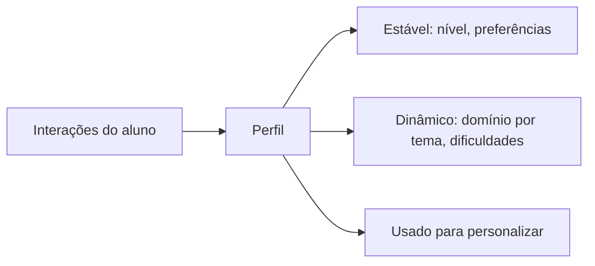

# Aula 1, Perfil do aluno

> Esta aula abre a modelagem de longo prazo do aluno. Para personalizar o ensino, o
> assistente precisa de um modelo de quem é cada aluno, o seu perfil. Vamos definir e
> construir esse perfil, que acumula o que sabemos sobre o aluno ao longo do tempo.

Os módulos anteriores nos deram um assistente que ensina, age e analisa. Mas ele ainda trata todos
os alunos da mesma forma. Um bom tutor humano não faz isso, ele conhece cada aluno, sabe o nível
de cada um, em que tem dificuldade, como prefere aprender, e adapta o ensino a isso. Para o nosso
assistente fazer o mesmo, ele precisa de um modelo do aluno, e o ponto de partida desse modelo é o
perfil.

O perfil é a representação estruturada do que sabemos sobre um aluno. Ele guarda informações
estáveis, como o nível e as preferências, e informações que evoluem, como o domínio de cada tema.
Diferente das métricas de uma sessão, o perfil é persistente e cumulativo, ele cresce a cada
interação, formando uma imagem cada vez mais rica do aluno. Nesta aula você vai definir e construir
esse perfil, a fundação da personalização.

---

## Objetivos

Ao final desta aula, você deve ser capaz de:

- Explicar o que é o perfil de um aluno e para que ele serve.
- Distinguir informações estáveis de informações que evoluem.
- Implementar uma estrutura de perfil que acumula conhecimento sobre o aluno.
- Atualizar o perfil a partir das interações.

## Teoria

O perfil de um aluno organiza, em um só lugar, o que o sistema sabe sobre ele. As informações se
dividem em duas naturezas. As estáveis mudam pouco, como o nome, o nível geral declarado e as
preferências de aprendizagem, por exemplo gostar de exemplos visuais. As dinâmicas evoluem com o
uso, como o domínio de cada tema, os temas com dificuldade, e o histórico de desempenho.



A modelagem do aluno é um campo clássico da computação educacional, e o perfil é a sua peça
central, como discutem trabalhos sobre hipermídia adaptativa, de Brusilovsky. O perfil é o que
permite ao sistema responder de forma diferente a alunos diferentes, e por isso a sua riqueza
define o teto da personalização. Um perfil pobre leva a uma personalização rasa, um perfil rico
permite uma adaptação fina.

A atualização do perfil é contínua. Cada interação, cada exercício respondido, cada dúvida, traz
informação nova, e o perfil a incorpora. Esse processo de acumular evidências sobre o aluno é o que
transforma interações isoladas em um conhecimento crescente, base do acompanhamento de longo prazo.

## Explicação Intuitiva

Pense na ficha que um bom professor mantém, mentalmente ou no papel, sobre cada aluno. Ele anota
que a Ana é visual e aprende rápido, que o Bruno trava em frações mas vai bem em geometria, que a
Carla precisa de mais exemplos. Com essa ficha, o professor adapta a aula a cada um. O perfil é
essa ficha, mantida pelo sistema, e atualizada a cada aula.

A diferença entre o estável e o dinâmico é como a diferença entre o nome do aluno, que não muda, e
as suas notas, que evoluem. O nome você anota uma vez. As notas você atualiza sempre. O perfil
mistura os dois, guardando o que é fixo e acompanhando o que muda, para ter sempre uma imagem
atual e completa do aluno.

## Explicação Matemática

O perfil é uma estrutura de dados, mais do que uma fórmula. Podemos representá-lo como um conjunto
de atributos, $\text{perfil} = \{\text{nível}, \text{preferências}, M\}$, em que $M$ é um mapa do
domínio de cada tema, $M[\text{tema}] \in [0, 1]$, indicando o quanto o aluno domina aquele
assunto.

A atualização é uma função que incorpora uma nova evidência ao perfil. Para o domínio de um tema,
uma forma simples é uma média móvel sobre os acertos. Se a evidência é um acerto em um tema, o
domínio daquele tema sobe; se é um erro, desce. Na próxima aula formalizaremos essa atualização com
o knowledge tracing, mas a ideia já está aqui, o perfil é um estado que se atualiza a cada
observação, refinando a estimativa do que o aluno sabe.

## Exemplo Prático

Vamos construir uma estrutura de perfil que guarda o nível, as preferências e o domínio por tema,
e atualizá-la a partir de respostas a exercícios. Cada acerto aumenta o domínio do tema, cada erro
o diminui, de forma simples, e o perfil vai refletindo o que o aluno sabe.

A estrutura é determinística e roda sem o modelo. O código está no notebook
[notebooks/modulo-13/01-perfil-do-aluno.ipynb](https://github.com/LucasSpinola/assistentes-educacionais-com-ia/blob/main/notebooks/modulo-13/01-perfil-do-aluno.ipynb),
então abra-o ao lado para acompanhar.

## Código Comentado

```python
from dataclasses import dataclass, field


@dataclass
class PerfilAluno:
    """Modelo do aluno: parte estável e parte dinâmica."""
    nome: str
    nivel: str = "iniciante"                      # estável
    preferencias: list = field(default_factory=list)
    dominio: dict = field(default_factory=dict)   # dinâmico: tema -> [0, 1]

    def registrar_resposta(self, tema, correto, passo=0.2):
        """Atualiza o domínio de um tema a partir de uma resposta."""
        atual = self.dominio.get(tema, 0.3)        # começa com domínio baixo
        if correto:
            atual = min(1.0, atual + passo)
        else:
            atual = max(0.0, atual - passo)
        self.dominio[tema] = round(atual, 2)

    def temas_fracos(self, limiar=0.5):
        return [t for t, d in self.dominio.items() if d < limiar]


# Constrói e atualiza o perfil da Ana ao longo de uma sessão.
ana = PerfilAluno("Ana", nivel="iniciante", preferencias=["exemplos visuais"])
for tema, correto in [("derivada", True), ("derivada", True), ("matriz", False), ("matriz", False)]:
    ana.registrar_resposta(tema, correto)

print("Perfil:", ana.nome, "| nível:", ana.nivel, "| prefere:", ana.preferencias)
print("Domínio por tema:", ana.dominio)
print("Temas fracos:", ana.temas_fracos())
```

Ao rodar, o perfil da Ana reflete a sessão. O domínio de derivada subiu com os acertos, e o de
matriz caiu com os erros, deixando matriz na lista de temas fracos. A parte estável, nível e
preferências, permanece. Esse perfil, que mistura o que é fixo com o que evolui, é a base de tudo o
que vem no módulo. Na próxima aula, fazemos esse conhecimento persistir entre as sessões, e depois
o refinamos com a modelagem cognitiva.

## Exercícios

1) Conceitual: Qual a diferença entre as informações estáveis e dinâmicas de um perfil? Dê exemplos.
2) Conceitual: Por que a riqueza do perfil define o teto da personalização?
3) Prático: Acrescente ao perfil um campo de ritmo preferido, por exemplo rápido ou devagar, e
   use-o.
4) Prático: Mude o passo de atualização do domínio e observe como o perfil reage mais ou menos
   rápido às respostas.
5) Extensão: Pesquise os tipos de modelo do aluno em sistemas tutores inteligentes, como o modelo
   de sobreposição.

## Projeto da Aula

Construa um perfil de aluno acumulativo. A entrega é uma estrutura de perfil com partes estável e
dinâmica, e métodos para atualizá-la a partir de respostas e consultar o domínio e os temas fracos,
simulando uma sessão de estudo.

Considere o projeto pronto quando o perfil refletir corretamente uma sessão de acertos e erros, com
o domínio subindo e descendo por tema, e quando você escrever um parágrafo sobre quais outras
informações enriqueceriam o perfil. Esse perfil é a fundação do sistema adaptativo que construímos
no projeto do módulo.

## Leituras Recomendadas

- O artigo de Brusilovsky sobre hipermídia adaptativa e modelagem do usuário.
- Materiais sobre sistemas tutores inteligentes e modelos do aluno.
- O artigo dos agentes generativos, de Park e colegas, sobre perfis que evoluem.

## Referências Científicas

As referências abaixo são reais e estão registradas em
[references/referencias.bib](../../references/referencias.bib). As chaves entre
parênteses são as do BibTeX.

- Brusilovsky, P. (2001). Adaptive Hypermedia. User Modeling and User-Adapted Interaction, 11(1-2),
  87-110. (`brusilovsky2001adaptive`)
- Corbett, A. T., e Anderson, J. R. (1994). Knowledge Tracing: Modeling the Acquisition of
  Procedural Knowledge. UMUAI, 4(4), 253-278. (`corbett1994knowledge`)
- Park, J. S., et al. (2023). Generative Agents: Interactive Simulacra of Human Behavior. UIST.
  (`park2023generative`)
