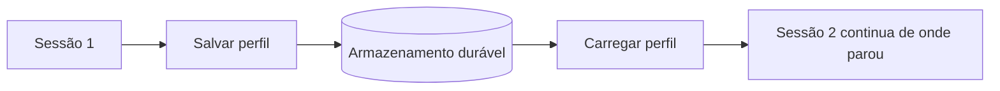

# Aula 2, Memória de longo prazo

> Esta aula faz o perfil do aluno sobreviver entre as sessões. Um acompanhamento de
> longo prazo só existe se o sistema lembra do aluno de um dia para o outro. Vamos
> dar persistência ao perfil, salvando e carregando o modelo do aluno.

O perfil que construímos na aula anterior tem um problema, ele vive só na memória do programa.
Quando a sessão termina e o programa fecha, tudo se perde, e na próxima vez o aluno é um
desconhecido de novo. Isso quebra a promessa do acompanhamento de longo prazo. Um tutor que esquece
o aluno a cada encontro nunca vai personalizar de verdade.

A solução é a memória de longo prazo persistente. Diferente da memória de curto prazo do Módulo 10,
que vale só durante a conversa, a memória de longo prazo precisa atravessar sessões, dias, meses. Na
prática, isso significa salvar o perfil em um meio durável, como um arquivo ou um banco de dados, e
carregá-lo quando o aluno volta. Nesta aula você vai dar essa persistência ao perfil, o passo que
transforma um modelo efêmero em um acompanhamento contínuo.

---

## Objetivos

Ao final desta aula, você deve ser capaz de:

- Explicar por que o acompanhamento de longo prazo exige persistência.
- Diferenciar a memória de curto prazo da de longo prazo persistente.
- Salvar e carregar o perfil de um aluno em um formato durável.
- Reconhecer as opções de armazenamento e os seus prós e contras.

## Teoria

A memória de longo prazo guarda o modelo do aluno fora do programa, em um meio que sobrevive ao
fim da execução. As duas operações fundamentais são salvar, que grava o perfil atual no
armazenamento, e carregar, que recupera o perfil de um aluno quando ele volta. Entre uma sessão e
outra, o perfil fica guardado, e cada nova sessão começa de onde a anterior parou.



O formato e o meio de armazenamento variam. Para começar, um arquivo em formato JSON é simples,
legível e suficiente, cada aluno em um arquivo, ou todos em um. Para sistemas maiores, usa-se um
banco de dados, que oferece consultas, concorrência e escala. Para memória semântica, em que se
quer recuperar lembranças por similaridade, entram os bancos vetoriais do Módulo 9. A escolha
depende do tamanho e das necessidades do sistema.

Há também a dimensão da gestão da memória. Com o tempo, o perfil acumula muita informação, e pode
ser preciso resumir o que é antigo, descartar o que é irrelevante, e manter o que importa. Essa
curadoria, presente em agentes com memória rica como os de Park e colegas, mantém o perfil útil sem
deixá-lo crescer sem controle.

## Explicação Intuitiva

Pense na diferença entre lembrar de uma conversa enquanto ela acontece e ter um caderno onde você
anota o que importa para consultar depois. A memória da conversa some quando ela acaba. O caderno
fica, e você o reabre no próximo encontro, retomando exatamente de onde parou. A memória de longo
prazo é esse caderno do tutor sobre cada aluno.

Salvar e carregar são como fechar e reabrir o caderno. Ao fim da aula, o tutor anota as novidades e
guarda o caderno. No começo da próxima, ele reabre o caderno daquele aluno e relembra tudo, o
nível, as dificuldades, o progresso. Sem esse caderno, cada aula recomeçaria do zero. Com ele, há
continuidade, e a continuidade é a alma do acompanhamento.

## Explicação Matemática

A persistência é mais uma questão de engenharia do que de matemática. O que vale formalizar é o
ciclo de vida do perfil. O perfil é um estado $s$. Ao fim de uma sessão, aplicamos $\text{salvar}(s)
\to \text{armazenamento}$. No início da próxima, $\text{carregar}(\text{aluno}) \to s$, recuperando
o estado. Durante a sessão, $s$ é atualizado pelas interações, como na aula anterior.

A serialização é o que torna isso possível. Converter o perfil, que é uma estrutura de objetos, em
um formato textual como o JSON, e depois reconstruí-lo, é o que permite gravá-lo e lê-lo. A
operação precisa ser fiel, o perfil carregado deve ser idêntico ao salvo, para que nenhuma
informação se perca na ida e na volta. Garantir essa fidelidade é o cuidado central da persistência.

## Exemplo Prático

Vamos dar persistência ao perfil, com métodos para salvar em um arquivo JSON e carregar de volta.
Simulamos duas sessões, na primeira o aluno estuda e o perfil é salvo, na segunda o perfil é
carregado e a sessão continua de onde parou, mostrando a continuidade.

A persistência usa só a biblioteca padrão e roda sem o modelo. O código está no notebook
[notebooks/modulo-13/02-memoria-de-longo-prazo.ipynb](../../notebooks/modulo-13/02-memoria-de-longo-prazo.ipynb),
então abra-o ao lado para acompanhar.

## Código Comentado

```python
import json


class PerfilPersistente:
    """Perfil do aluno que pode ser salvo e carregado de um arquivo JSON."""

    def __init__(self, nome, nivel="iniciante", dominio=None):
        self.nome = nome
        self.nivel = nivel
        self.dominio = dominio or {}

    def registrar_resposta(self, tema, correto, passo=0.2):
        atual = self.dominio.get(tema, 0.3)
        atual = min(1.0, atual + passo) if correto else max(0.0, atual - passo)
        self.dominio[tema] = round(atual, 2)

    def salvar(self, caminho):
        with open(caminho, "w", encoding="utf-8") as f:
            json.dump({"nome": self.nome, "nivel": self.nivel, "dominio": self.dominio}, f)

    @classmethod
    def carregar(cls, caminho):
        with open(caminho, encoding="utf-8") as f:
            d = json.load(f)
        return cls(d["nome"], d["nivel"], d["dominio"])


arquivo = "perfil_ana.json"

# Sessão 1: a Ana estuda e o perfil é salvo.
ana = PerfilPersistente("Ana")
ana.registrar_resposta("derivada", True)
ana.registrar_resposta("derivada", True)
ana.salvar(arquivo)
print("Sessão 1, domínio salvo:", ana.dominio)

# Sessão 2: o perfil é carregado e a sessão continua.
ana2 = PerfilPersistente.carregar(arquivo)
print("Sessão 2, domínio carregado:", ana2.dominio)
ana2.registrar_resposta("derivada", True)
print("Sessão 2, após nova resposta:", ana2.dominio)
```

Ao rodar, a primeira sessão estuda derivada e salva o perfil, com o domínio já elevado. A segunda
sessão carrega esse mesmo perfil, e a Ana não é mais uma desconhecida, o sistema lembra que ela já
domina bem a derivada, e a sessão continua de onde parou. Essa continuidade entre sessões é o que
permite o acompanhamento de longo prazo. Na próxima aula, refinamos a estimativa de domínio com a
modelagem cognitiva.

## Exercícios

1) Conceitual: Por que a persistência é necessária para o acompanhamento de longo prazo?
2) Conceitual: Compare um arquivo JSON e um banco de dados como meios de armazenar o perfil.
3) Prático: Salve e carregue os perfis de vários alunos, cada um em um arquivo, e verifique a
   fidelidade.
4) Prático: Adicione um campo de data da última sessão ao perfil e atualize-o ao salvar.
5) Extensão: Pesquise a memória semântica em agentes, que recupera lembranças por similaridade com a
   busca vetorial do Módulo 9.

## Projeto da Aula

Dê persistência ao perfil do aluno. A entrega é uma versão do perfil que salva o seu estado em um
arquivo e o carrega de volta de forma fiel, demonstrando a continuidade entre duas sessões
simuladas.

Considere o projeto pronto quando o perfil salvo e carregado for idêntico, e quando você mostrar uma
sessão que retoma exatamente de onde a anterior parou, com um parágrafo sobre como gerenciaria a
memória conforme ela cresce. Essa persistência é o que dá sentido à modelagem cognitiva e à
personalização das próximas aulas.

## Leituras Recomendadas

- O artigo dos agentes generativos, de Park e colegas, sobre memória de longo prazo e curadoria.
- Documentação sobre serialização em JSON e formatos de persistência em Python.
- Materiais sobre memória semântica e recuperação de lembranças em assistentes.

## Referências Científicas

As referências abaixo são reais e estão registradas em
[references/referencias.bib](../../references/referencias.bib). As chaves entre
parênteses são as do BibTeX.

- Park, J. S., et al. (2023). Generative Agents: Interactive Simulacra of Human Behavior. UIST.
  (`park2023generative`)
- Brusilovsky, P. (2001). Adaptive Hypermedia. User Modeling and User-Adapted Interaction, 11(1-2),
  87-110. (`brusilovsky2001adaptive`)
- Lewis, P., et al. (2020). Retrieval-Augmented Generation for Knowledge-Intensive NLP Tasks.
  NeurIPS. (`lewis2020rag`)
