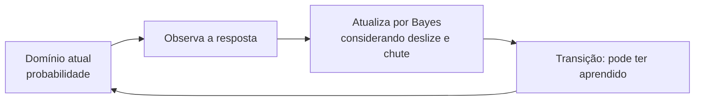

# Aula 3, Modelagem cognitiva

> Esta aula refina a estimativa do que o aluno sabe. Em vez de uma média grosseira,
> usamos o knowledge tracing, uma técnica clássica que modela o domínio de cada
> habilidade como uma probabilidade que se atualiza a cada resposta.

Nas aulas anteriores, atualizamos o domínio de um tema somando ou subtraindo um passo fixo a cada
acerto ou erro. Funciona, mas é grosseiro. Ele não distingue um acerto por domínio de um acerto por
sorte, nem um erro por falta de conhecimento de um erro por descuido. E não tem uma interpretação
clara, o número não diz quanto o aluno realmente sabe. Para um sistema adaptativo de verdade,
precisamos de algo mais fino.

A modelagem cognitiva trata o conhecimento do aluno como uma quantidade a ser estimada a partir de
evidências, as respostas. A técnica clássica para isso é o knowledge tracing, proposto por Corbett e
Anderson, que modela o domínio de cada habilidade como uma probabilidade e a atualiza a cada
resposta usando o raciocínio de Bayes. Nesta aula você vai entender e implementar o knowledge
tracing, dando ao perfil uma estimativa de domínio com fundamento e interpretação.

---

## Objetivos

Ao final desta aula, você deve ser capaz de:

- Explicar o que é knowledge tracing e por que ele supera uma média simples.
- Entender os parâmetros de domínio, aprendizagem, deslize e chute.
- Implementar a atualização bayesiana do domínio a cada resposta.
- Interpretar a probabilidade de domínio de uma habilidade.

## Teoria

O knowledge tracing modela, para cada habilidade, a probabilidade de o aluno dominá-la, um número
entre 0 e 1. A cada resposta, essa probabilidade é atualizada. A grande sacada é levar em conta que
a observação é ruidosa. Um aluno que domina pode errar por descuido, o deslize, e um aluno que não
domina pode acertar por sorte, o chute. O modelo tem quatro parâmetros, a probabilidade inicial de
domínio, a probabilidade de aprender entre tentativas, a probabilidade de deslize e a de chute.



A atualização tem dois passos. Primeiro, o passo bayesiano, que revisa a probabilidade de domínio à
luz da resposta, pesando deslize e chute. Um acerto aumenta a probabilidade de domínio, mas não a
crava em 1, porque pode ter sido chute. Um erro a diminui, mas não a zera, porque pode ter sido
deslize. Segundo, o passo de transição, que adiciona a chance de o aluno ter aprendido com a própria
tentativa, refletindo que praticar ensina.

Essa abordagem deu origem a uma família de métodos. As versões modernas, como o deep knowledge
tracing de Piech e colegas, usam redes neurais, em particular as recorrentes do Módulo 5, para
modelar o conhecimento de forma ainda mais rica. Mas o knowledge tracing clássico, que vamos
implementar, já captura a ideia central e é interpretável.

## Explicação Intuitiva

Pense em estimar se um amigo sabe cozinhar, observando os pratos que ele faz. Se ele acerta um
prato, você fica mais confiante de que sabe, mas não tem certeza, pode ter dado sorte. Se erra,
você desconfia, mas não descarta, pode ter sido um dia ruim. A cada prato, você ajusta a sua
estimativa, levando em conta que tanto a sorte quanto o azar existem. O knowledge tracing faz isso
com o conhecimento do aluno.

Os parâmetros de deslize e chute são o reconhecimento de que a vida tem ruído. Sem eles, um único
erro zeraria a confiança, e um único acerto a cravaria, o que seria ingênuo. Com eles, o modelo é
prudente, acumula evidências aos poucos, e chega a uma estimativa estável que reflete o
conhecimento real, não o acaso de uma resposta. Essa prudência é o que torna a estimativa confiável.

## Explicação Matemática

Seja $p$ a probabilidade atual de o aluno dominar a habilidade. Após observar uma resposta, fazemos
o passo bayesiano. Se a resposta foi correta, com probabilidade de deslize $s$ e de chute $g$,

$$
p_{\text{cond}} = \frac{p\,(1 - s)}{p\,(1 - s) + (1 - p)\,g}.
$$

Se foi incorreta,

$$
p_{\text{cond}} = \frac{p\,s}{p\,s + (1 - p)\,(1 - g)}.
$$

Em seguida, o passo de transição, com probabilidade de aprendizagem $\ell$, atualiza para o próximo
instante,

$$
p_{\text{novo}} = p_{\text{cond}} + (1 - p_{\text{cond}})\,\ell.
$$

A primeira fórmula é o Teorema de Bayes, que já vimos no Naive Bayes do Módulo 1, aplicado a inferir
o domínio a partir da resposta. A segunda modela o aprendizado pela prática. Repetindo esse processo
a cada resposta, $p$ converge para perto de 1 se o aluno acerta consistentemente, e fica baixo se
erra, com a velocidade controlada pelos parâmetros.

## Exemplo Prático

Vamos implementar o knowledge tracing e acompanhar a probabilidade de domínio de um aluno ao longo de
respostas. A expectativa, que vamos confirmar, é que acertos sucessivos elevem o domínio rumo a 1,
enquanto erros sucessivos o mantenham baixo, sempre de forma gradual, por causa do deslize e do
chute.

A atualização é determinística e roda sem o modelo. O código está no notebook
[notebooks/modulo-13/03-modelagem-cognitiva.ipynb](https://github.com/LucasSpinola/assistentes-educacionais-com-ia/blob/main/notebooks/modulo-13/03-modelagem-cognitiva.ipynb),
então abra-o ao lado para acompanhar.

## Código Comentado

```python
def atualizar_maestria(p_dominio, correto, p_aprender=0.2, p_deslize=0.1, p_chute=0.2):
    """Knowledge tracing: atualiza a probabilidade de domínio dada uma resposta."""
    # Passo bayesiano: revisa o domínio à luz da resposta, com deslize e chute.
    if correto:
        num = p_dominio * (1 - p_deslize)
        den = p_dominio * (1 - p_deslize) + (1 - p_dominio) * p_chute
    else:
        num = p_dominio * p_deslize
        den = p_dominio * p_deslize + (1 - p_dominio) * (1 - p_chute)
    p_cond = num / den if den else p_dominio
    # Passo de transição: o aluno pode ter aprendido com a tentativa.
    return round(p_cond + (1 - p_cond) * p_aprender, 3)


# Aluno que acerta sempre: o domínio sobe rumo a 1.
p = 0.3
historico_acerta = [p]
for _ in range(5):
    p = atualizar_maestria(p, correto=True)
    historico_acerta.append(p)
print("Acertando sempre:", historico_acerta)

# Aluno que erra sempre: o domínio fica baixo.
p = 0.3
historico_erra = [p]
for _ in range(5):
    p = atualizar_maestria(p, correto=False)
    historico_erra.append(p)
print("Errando sempre: ", historico_erra)
```

Ao rodar, o aluno que acerta vê o seu domínio subir de 0,3 para perto de 1 em poucas respostas, mas
de forma gradual, sem cravar em 1 a cada acerto, por causa da possibilidade de chute. O aluno que
erra mantém o domínio baixo, em torno de 0,23, sem zerá-lo, por causa da possibilidade de deslize e
do aprendizado pela tentativa. Essa estimativa prudente e interpretável é muito superior à média
grosseira, e é o que vai guiar a personalização da próxima aula com fundamento.

## Exercícios

1) Conceitual: O que são os parâmetros de deslize e chute, e por que eles tornam o modelo mais
   realista?
2) Conceitual: Por que um único acerto não crava o domínio em 1 no knowledge tracing?
3) Prático: Mude os parâmetros de deslize e chute e observe como a velocidade de atualização muda.
4) Prático: Simule um aluno que alterna acertos e erros e acompanhe a evolução do domínio.
5) Extensão: Pesquise o deep knowledge tracing de Piech e colegas e explique como ele usa redes
   recorrentes.

## Projeto da Aula

Construa um rastreador de conhecimento por habilidade. A entrega é um programa que mantém a
probabilidade de domínio de várias habilidades de um aluno, atualizando cada uma com o knowledge
tracing conforme as respostas, e que reporta o domínio estimado de cada habilidade.

Considere o projeto pronto quando o domínio das habilidades evoluir de forma coerente com o
histórico de respostas, e quando você escrever um parágrafo comparando o knowledge tracing com a
média simples da primeira aula. Essa estimativa fundamentada do conhecimento é o coração do sistema
adaptativo do projeto do módulo.

## Leituras Recomendadas

- O artigo de Corbett e Anderson que introduziu o knowledge tracing.
- O artigo do deep knowledge tracing, de Piech e colegas, sobre a versão com redes neurais.
- Materiais sobre o Teorema de Bayes aplicado à modelagem do conhecimento.

## Referências Científicas

As referências abaixo são reais e estão registradas em
[references/referencias.bib](../../references/referencias.bib). As chaves entre
parênteses são as do BibTeX.

- Corbett, A. T., e Anderson, J. R. (1994). Knowledge Tracing: Modeling the Acquisition of
  Procedural Knowledge. UMUAI, 4(4), 253-278. (`corbett1994knowledge`)
- Piech, C., et al. (2015). Deep Knowledge Tracing. NeurIPS. (`piech2015deep`)
- Brusilovsky, P. (2001). Adaptive Hypermedia. User Modeling and User-Adapted Interaction, 11(1-2),
  87-110. (`brusilovsky2001adaptive`)
