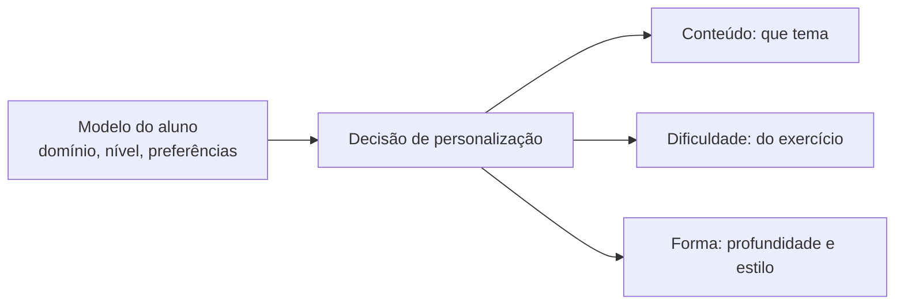

# Aula 4, Personalização

> Esta aula fecha o módulo colocando o modelo do aluno para trabalhar. Com o perfil,
> a persistência e a modelagem cognitiva, o assistente finalmente adapta o ensino a
> cada um. Vamos construir o sistema adaptativo que escolhe o que ensinar e como.

Construímos um modelo rico do aluno, com perfil persistente e domínio estimado por habilidade. Mas
um modelo só tem valor se for usado. A personalização é o passo que fecha o ciclo, transformar o que
sabemos sobre o aluno em decisões concretas sobre o que ensinar, em que profundidade e com que
dificuldade. É o que separa um assistente que dá a mesma coisa para todos de um que se molda a cada
um.

Personalizar é adaptar três coisas, principalmente. O conteúdo, escolhendo o próximo tema a estudar
conforme o domínio. A dificuldade, ajustando os exercícios para nem entediar nem frustrar. E a
forma, variando a profundidade da explicação conforme o nível e as preferências. Nesta aula você vai
construir o sistema adaptativo que toma essas decisões a partir do modelo do aluno, o projeto que
fecha o módulo e prepara o assistente final.

---

## Objetivos

Ao final desta aula, você deve ser capaz de:

- Explicar como o modelo do aluno orienta as decisões de personalização.
- Adaptar conteúdo, dificuldade e forma ao perfil do aluno.
- Implementar um recomendador adaptativo a partir do domínio.
- Reconhecer o princípio de manter o aluno na zona certa de desafio.

## Teoria

A personalização usa o modelo do aluno para tomar decisões. A partir do domínio de cada habilidade,
o sistema decide o que recomendar. Se o domínio de um tema é baixo, a recomendação é revisar, com
explicação detalhada e exercícios fáceis. Se é intermediário, é praticar, com dificuldade média. Se
é alto, é avançar, com explicação breve e exercícios desafiadores. As preferências do perfil afinam
a forma, por exemplo privilegiando exemplos visuais para quem gosta deles.



Há um princípio que guia o ajuste da dificuldade, manter o aluno na zona certa de desafio, nem fácil
demais, o que entedia, nem difícil demais, o que frustra. Essa ideia, ligada à noção de zona de
desenvolvimento proximal e estudada na hipermídia adaptativa de Brusilovsky, é o que torna a
personalização eficaz. O melhor exercício é o que está um pouco além do que o aluno já domina,
puxando-o para frente sem perdê-lo.

A personalização fecha o laço de adaptação. O aluno interage, o modelo se atualiza, a personalização
decide a próxima ação, o aluno interage de novo, e assim por diante. Cada volta refina o modelo e
ajusta a experiência, criando um sistema que aprende sobre o aluno ao mesmo tempo em que o ensina.

## Explicação Intuitiva

Pense no melhor professor particular que você já viu. Ele não segue um roteiro fixo, ele observa o
aluno e ajusta tudo na hora. Percebe que o aluno travou em um conceito e volta a explicá-lo com
outro exemplo. Vê que ele pegou rápido e propõe um desafio maior. Sente que ele está cansado e muda
o ritmo. Essa adaptação constante ao aluno à frente é a essência da boa tutoria, e é o que a
personalização tenta automatizar.

A zona certa de desafio é a chave dessa arte. Dar um exercício fácil demais para quem já domina é
perder tempo e entediar. Dar um difícil demais para quem está começando é frustrar e desanimar. O
ponto ideal é o desafio na medida, que exige esforço mas é alcançável, e é aí que o aprendizado
acontece. Um bom sistema adaptativo persegue esse ponto para cada aluno, o tempo todo.

## Explicação Matemática

A personalização é uma função de decisão sobre o modelo do aluno. Dado o domínio $p$ de uma
habilidade, escolhemos a ação por faixas, por exemplo revisar se $p < 0{,}4$, praticar se $0{,}4
\le p < 0{,}8$, e avançar se $p \ge 0{,}8$. A cada faixa associamos uma profundidade de explicação e
uma dificuldade de exercício. É uma política simples, mas eficaz, que mapeia o estado do
conhecimento em uma recomendação.

O princípio da zona de desafio pode ser visto como buscar uma dificuldade $d$ próxima do domínio
atual, $d \approx p$, um pouco acima. Em sistemas mais sofisticados, isso vira um problema de
otimização, escolher o item que maximiza o aprendizado esperado, equilibrando desafio e sucesso. Na
nossa versão, a política por faixas já aproxima bem esse princípio, mantendo o aluno desafiado na
medida certa conforme o seu domínio evolui.

## Exemplo Prático

Vamos construir um recomendador adaptativo que, a partir do domínio de uma habilidade, decide a ação,
a profundidade da explicação e a dificuldade do exercício. Aplicado a alunos com domínios diferentes,
ele produz recomendações diferentes, mostrando a personalização em ação.

A decisão é determinística e roda sem o modelo. O código está no notebook
[notebooks/modulo-13/04-personalizacao.ipynb](https://github.com/LucasSpinola/assistentes-educacionais-com-ia/blob/main/notebooks/modulo-13/04-personalizacao.ipynb),
então abra-o ao lado para acompanhar.

## Código Comentado

```python
def recomendar(dominio, preferencias=None):
    """Decide a ação, a profundidade e a dificuldade a partir do domínio."""
    preferencias = preferencias or []
    if dominio < 0.4:
        acao, profundidade, dificuldade = "revisar", "explicação detalhada", "exercício fácil"
    elif dominio < 0.8:
        acao, profundidade, dificuldade = "praticar", "explicação intermediária", "exercício médio"
    else:
        acao, profundidade, dificuldade = "avançar", "explicação breve", "exercício difícil"
    # Afina a forma pelas preferências do aluno.
    if "exemplos visuais" in preferencias:
        profundidade += ", com um diagrama"
    return {"acao": acao, "profundidade": profundidade, "dificuldade": dificuldade}


# Três alunos com domínios diferentes na mesma habilidade.
alunos = [
    ("Ana", 0.2, ["exemplos visuais"]),
    ("Bruno", 0.6, []),
    ("Carla", 0.9, []),
]
for nome, dominio, prefs in alunos:
    r = recomendar(dominio, prefs)
    print(f"{nome} (domínio {dominio}): {r['acao']}, {r['profundidade']}, {r['dificuldade']}")
```

Ao rodar, cada aluno recebe uma recomendação adequada ao seu domínio. A Ana, com domínio baixo, é
orientada a revisar, com explicação detalhada e, por preferir, um diagrama, e exercício fácil. O
Bruno, intermediário, vai praticar com dificuldade média. A Carla, que domina bem, avança para um
desafio maior com explicação breve. O mesmo sistema, três experiências diferentes, cada uma na zona
certa de desafio daquele aluno. É a personalização que fecha o módulo e dá vida ao modelo do aluno.

## Exercícios

1) Conceitual: Quais três dimensões a personalização adapta, e como o modelo do aluno orienta cada
   uma?
2) Conceitual: Explique o princípio da zona certa de desafio e por que ele torna a personalização
   eficaz.
3) Prático: Acrescente uma quarta faixa de domínio, para alunos no limite entre revisar e praticar.
4) Prático: Use outra preferência do perfil, como ritmo devagar, para afinar a recomendação.
5) Extensão: Pesquise a zona de desenvolvimento proximal de Vygotsky e relacione com o ajuste de
   dificuldade.

## Projeto da Aula e Projeto do Módulo

Este é o projeto que fecha o módulo, o sistema adaptativo de aprendizagem, na pasta
`projects/m13-student-modeling/`. A entrega reúne tudo, o perfil persistente, o knowledge tracing
para estimar o domínio, e o recomendador adaptativo, em um sistema que ajusta as explicações e os
exercícios ao perfil e ao histórico do aluno.

O roteiro sugerido é o seguinte. Mantenha um perfil de aluno com domínio por habilidade, atualizado
por knowledge tracing e persistido entre sessões. A cada interação, atualize o domínio com a
resposta, e use o recomendador para decidir a próxima ação, a profundidade e a dificuldade. Simule
uma trajetória de aprendizagem e mostre como as recomendações evoluem conforme o domínio melhora.

Considere o projeto pronto quando o sistema adaptar as recomendações ao longo da trajetória do
aluno, de revisar para praticar e avançar conforme o domínio sobe, e quando você escrever um
parágrafo sobre como manteve o aluno na zona certa de desafio. Com isso, você fecha a modelagem de
longo prazo, e tem todas as peças para o assistente educacional completo do Módulo 14.

## Leituras Recomendadas

- O artigo de Brusilovsky sobre hipermídia adaptativa e personalização.
- Materiais sobre a zona de desenvolvimento proximal e o ajuste de desafio.
- Estudos sobre sistemas tutores inteligentes e a eficácia da adaptação.

## Referências Científicas

As referências abaixo são reais e estão registradas em
[references/referencias.bib](../../references/referencias.bib). As chaves entre
parênteses são as do BibTeX.

- Brusilovsky, P. (2001). Adaptive Hypermedia. User Modeling and User-Adapted Interaction, 11(1-2),
  87-110. (`brusilovsky2001adaptive`)
- Corbett, A. T., e Anderson, J. R. (1994). Knowledge Tracing: Modeling the Acquisition of
  Procedural Knowledge. UMUAI, 4(4), 253-278. (`corbett1994knowledge`)
- Piech, C., et al. (2015). Deep Knowledge Tracing. NeurIPS. (`piech2015deep`)
