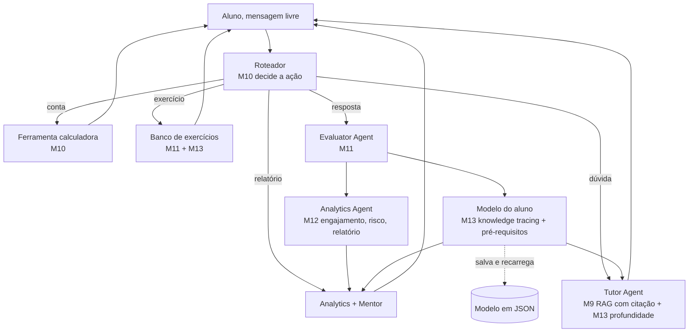

# Guia 1, Arquitetura do assistente

> Este guia abre o projeto final, em que tudo se junta. Vamos desenhar a arquitetura
> do Multi-Agent Educational Assistant, mostrando como as peças dos treze módulos se
> encaixam em um único sistema coeso.

Você percorreu uma trilha longa, dos fundamentos de IA até a modelagem de longo prazo do aluno. A
cada módulo, construiu uma peça, e muitas vezes parou para pensar como elas se conectavam. Chegou a
hora de juntar tudo. O projeto final é o Multi-Agent Educational Assistant with Learning Analytics
and Long-Term Student Modeling, um assistente que ensina, avalia, orienta, analisa e se adapta a
cada aluno.

Antes de programar, é preciso desenhar. Um sistema que integra tantas partes exige uma arquitetura
clara, que diga quem faz o quê e como as peças conversam. Este guia apresenta essa arquitetura,
mostrando como o RAG, os agentes, o multi-agentes, o analytics e a modelagem do aluno se combinam.
Entender o desenho é o que torna a construção, no próximo guia, uma questão de montar peças que você
já conhece.

---

## Objetivos

Ao final deste guia, você deve ser capaz de:

- Descrever a arquitetura geral do assistente educacional completo.
- Identificar de qual módulo vem cada componente do sistema.
- Entender como os componentes se comunicam para atender o aluno.
- Reconhecer o fluxo de uma interação, da pergunta à resposta personalizada.

## A arquitetura

O assistente é organizado em torno de um coordenador que, no padrão do agente do Módulo 10, lê a
mensagem livre do aluno, decide qual ação tomar e a encaminha ao componente certo. Esse roteamento é
o que torna o coordenador um agente que decide, e não um simples seletor de comandos pré-rotulados.
Cada componente é uma peça que você construiu em um módulo anterior.

Vejamos cada peça e a sua origem na trilha. O roteador, do Módulo 10, classifica a mensagem do aluno
em uma ação, dúvida, conta, pedido de exercício, resposta a um exercício ou relatório. O Tutor Agent
ensina, e para isso busca o trecho mais relevante no material com o RAG do Módulo 9, cita a fonte, e
adapta a profundidade da explicação ao domínio do aluno, usando a personalização do Módulo 13. A
ferramenta de calculadora, do Módulo 10, resolve contas com segurança. O banco de exercícios propõe
a questão na dificuldade certa, e o Evaluator Agent, do Módulo 11, corrige a resposta. Cada
avaliação atualiza o modelo do aluno, com o knowledge tracing do Módulo 13, e registra o evento no
Analytics, do Módulo 12. O Mentor Agent, do Módulo 11, usa o modelo e o analytics para sugerir o
próximo passo, respeitando um grafo de pré-requisitos entre os temas. E o modelo do aluno é salvo ao
final e recarregado na sessão seguinte, garantindo o acompanhamento de longo prazo.

## O fluxo de uma interação

Para sentir a arquitetura em movimento, acompanhe o que acontece em uma sessão. O aluno digita em
texto livre, e o roteador decide a ação. Quando é uma dúvida, o Tutor busca o trecho no material e o
entrega, citando a fonte, na profundidade certa para o domínio atual daquele aluno. Quando o aluno
pede um exercício, o assistente escolhe um na dificuldade recomendada e o propõe. Quando o aluno
responde, o Evaluator corrige, atualiza o domínio daquele tema no modelo do aluno, e registra o
resultado no Analytics. Quando o aluno pede orientação, o Mentor olha o modelo e o analytics,
identifica os temas fracos, e sugere revisar ou avançar para o próximo tema desbloqueado.

Repare na sinergia. O modelo do aluno, alimentado pelas avaliações, é o que permite ao Tutor
personalizar e ao Mentor orientar. O Analytics, alimentado pelos mesmos eventos, dá a visão do
desempenho. Tudo se conecta pelo coordenador e pelo modelo compartilhado do aluno, e o resultado é
um comportamento de acompanhamento que nenhuma peça teria sozinha.

## O que cada módulo contribui

A tabela abaixo resume a contribuição de cada módulo ao assistente final, mostrando que o projeto é,
de fato, a costura de tudo o que você construiu.

| Módulo | Contribuição ao assistente |
|---|---|
| 1 a 6 | Os fundamentos: NLP, ML, embeddings, redes e Transformers que sustentam os LLMs |
| 7 e 8 | O LLM e o prompt engineering que dão voz e raciocínio ao assistente |
| 9 | O RAG por trecho com citação, que faz o Tutor responder com base no material |
| 10 | O agente que roteia a mensagem livre e as ferramentas, como a calculadora |
| 11 | O time de agentes especializados e o banco de exercícios com correção |
| 12 | O Learning Analytics, com engajamento, risco e relatório de sessão |
| 13 | A modelagem do aluno, knowledge tracing, pré-requisitos e personalização persistente |

A pesquisa mostra que sistemas tutores bem feitos se aproximam da eficácia da tutoria humana, como
revisou VanLehn, e que os LLMs abrem novas possibilidades e desafios para a educação, como discutem
Kasneci e colegas. O nosso assistente é uma síntese acessível dessas ideias.

## Próximos passos

Com a arquitetura clara, o próximo guia trata da construção e da avaliação, mostrando como montar o
assistente reunindo as peças e como testá-lo de ponta a ponta. O código completo já está no projeto
[projects/m14-final-assistant/](../../projects/m14-final-assistant/), pronto para estudar, rodar e
estender.

## Leituras Recomendadas

- O artigo de VanLehn sobre a eficácia de sistemas tutores inteligentes.
- O artigo de Kasneci e colegas sobre LLMs na educação.
- As referências de cada módulo da trilha, reunidas no arquivo de bibliografia.

## Referências Científicas

As referências abaixo são reais e estão registradas em
[references/referencias.bib](../../references/referencias.bib). As chaves entre
parênteses são as do BibTeX.

- VanLehn, K. (2011). The Relative Effectiveness of Human Tutoring, Intelligent Tutoring Systems, and
  Other Tutoring Systems. Educational Psychologist, 46(4), 197-221. (`vanlehn2011relative`)
- Kasneci, E., et al. (2023). ChatGPT for Good? On Opportunities and Challenges of Large Language
  Models for Education. Learning and Individual Differences, 103, 102274. (`kasneci2023chatgpt`)
- Brusilovsky, P. (2001). Adaptive Hypermedia. UMUAI, 11(1-2), 87-110. (`brusilovsky2001adaptive`)
