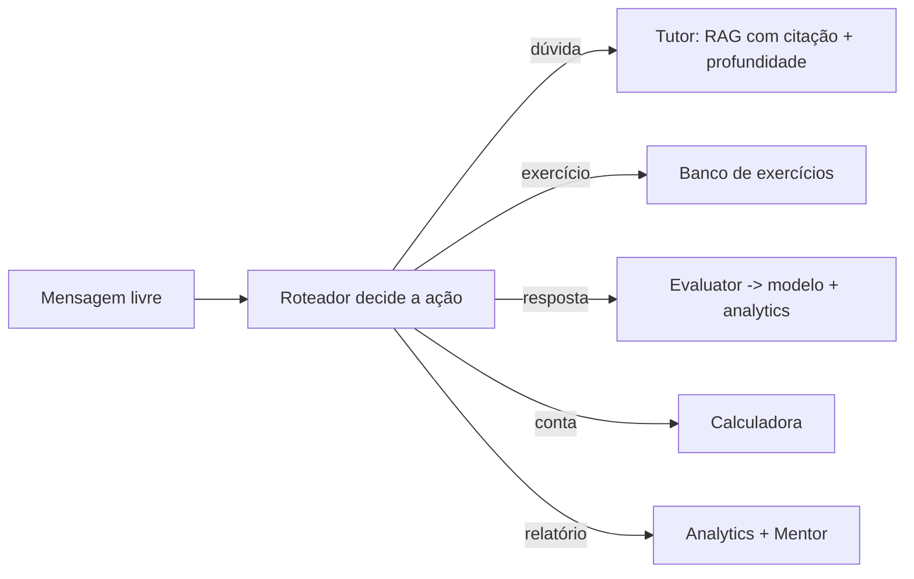

# Guia 2, Construção e avaliação

> Este guia mostra como montar o assistente final reunindo as peças da trilha, e como
> avaliá-lo de ponta a ponta. Vamos percorrer o código integrado e ver uma sessão
> completa do aluno, da pergunta à recomendação personalizada.

Com a arquitetura desenhada no guia anterior, a construção vira uma questão de montar peças que você
já conhece. Cada componente, o RAG, a calculadora, os agentes, o analytics, o modelo do aluno, já
foi construído e testado nos módulos anteriores. O trabalho aqui é integrá-los, conectando as
entradas e saídas pelo coordenador, e garantir que o todo funcione de forma coesa.

Construir é só metade do trabalho. A outra metade é avaliar, verificar que o assistente faz o que
deveria, de ponta a ponta. Um sistema integrado tem muitas partes móveis, e uma falha em uma peça
pode quebrar o conjunto. Por isso fechamos com testes que exercitam o fluxo completo. Este guia
percorre a construção e a avaliação, e o código completo, com testes, está no projeto
[projects/m14-final-assistant/](../../projects/m14-final-assistant/).

---

## Objetivos

Ao final deste guia, você deve ser capaz de:

- Integrar os componentes da trilha em um assistente coeso.
- Entender como o coordenador conecta as peças por mensagens.
- Executar e acompanhar uma sessão completa do aluno.
- Avaliar o assistente de ponta a ponta com testes.

## A construção

A integração se apoia no coordenador, que recebe a mensagem livre do aluno, decide a ação com o
roteador do Módulo 10, e a encaminha. Uma dúvida vai ao Tutor, que combina o RAG do Módulo 9, com
citação da fonte, e a personalização do Módulo 13. Um pedido de exercício aciona o banco de
exercícios, e a resposta do aluno vai ao Evaluator, que corrige e aciona em cadeia o modelo do aluno
e o analytics. Um pedido de relatório aciona o analytics e o Mentor.

O segredo da integração é o modelo do aluno compartilhado. Ele é alimentado pelas avaliações e
consultado pelo Tutor e pelo Mentor. Esse estado central, atualizado por knowledge tracing, é o que
costura a personalização ao longo da sessão, e a persistência dele garante a continuidade entre
sessões, porque o modelo é salvo ao final e recarregado na próxima. A montagem reúne, em uma classe
coordenadora, as instâncias dos componentes e o despacho das mensagens, sem que um componente precise
conhecer os detalhes internos do outro.

## Uma sessão completa

Acompanhe uma sessão real do assistente, que mostra todas as peças trabalhando juntas. Como tudo
roda a partir de mensagens em texto livre, o roteador é quem decide a ação a cada passo. O aluno
começa com uma dúvida sobre a derivada. O Tutor busca o trecho no material e, como o domínio do
aluno naquele tema é baixo, entrega uma explicação detalhada, de nível iniciante, citando a fonte e
ainda com um diagrama, porque o perfil do aluno prefere exemplos visuais.

Em seguida, o aluno pede um exercício de derivada. O assistente escolhe um na dificuldade certa e o
propõe, o aluno responde e acerta. O Evaluator confirma, e o modelo do aluno eleva o domínio de
derivada. Quando o aluno volta a perguntar sobre a derivada, algo mudou, como o domínio subiu, o
Tutor agora entrega uma explicação mais breve, adaptada ao novo nível. Depois, o aluno erra um
exercício de matriz, e o domínio de matriz cai. Por fim, o aluno pede um relatório, e o Mentor,
vendo o desempenho e o tema fraco, sugere revisar matriz e aponta o próximo tema recomendado.

Essa sessão, que roda no projeto, é a prova de que a integração funciona. A mesma pergunta recebeu
respostas de profundidade diferente conforme o domínio do aluno evoluiu, a avaliação alimentou o
modelo e o analytics, e a orientação final refletiu tudo. Ao encerrar, o assistente salva o modelo,
para lembrar do aluno na próxima sessão, e gera um relatório com engajamento, barras de domínio e o
risco de desengajamento. É o acompanhamento personalizado que toda a trilha vinha construindo.

## A avaliação

Avaliamos o assistente de ponta a ponta com testes que exercitam cada caminho do fluxo. Verificamos
que o roteador decide a ação certa para cada mensagem, que o Tutor busca no material, cita a fonte e
trata perguntas fora dele, que a calculadora funciona e bloqueia código não aritmético, que o
exercício proposto é corrigido e atualiza o modelo e o analytics, que o Mentor sugere o próximo tema
respeitando os pré-requisitos, que o modelo persiste de uma sessão para a outra, e, o mais
importante, que a personalização adapta a profundidade da explicação conforme o domínio do aluno
muda.

Esse último teste é o coração da avaliação, porque verifica a sinergia, não só as peças isoladas. Ele
confirma que uma sequência de acertos em um tema realmente muda, mais adiante, a forma como o Tutor
explica aquele tema. Quando um teste assim passa, sabemos que a integração entregou mais do que a
soma das partes, ela entregou o comportamento adaptativo que é a razão de ser do assistente.

## Como estender

O assistente do projeto roda do zero, sem dependências, para que toda a lógica fique visível. A
partir dele, há muitos caminhos de evolução, todos abertos pela trilha. Trocar a busca por
embeddings densos e um banco vetorial de produção. Usar o LLM via Ollama para gerar as explicações e
o feedback na profundidade recomendada. Adicionar mais agentes especializados, como um Motivador.
Persistir os dados de analytics e construir o dashboard do Módulo 12 sobre eles. Cada extensão é
plugar uma peça mais sofisticada de um módulo no lugar de uma simples.

## Conclusão da trilha

Se você chegou até aqui e montou o assistente, parabéns, você percorreu o caminho completo, do que é
IA até um sistema educacional inteligente, multi-agente, com analytics e modelagem de longo prazo do
aluno. Mais do que um sistema, você construiu o entendimento de cada peça, do tokenizador ao
knowledge tracing, sem caixas-pretas. Esse entendimento é o que vai te permitir ir além, pesquisar,
melhorar e criar os assistentes educacionais do futuro.

## Leituras Recomendadas

- O código completo e comentado em projects/m14-final-assistant/, com os seus testes.
- As referências de cada módulo, para aprofundar qualquer componente.
- Frameworks como LangGraph, AutoGen e LlamaIndex, para versões de produção do assistente.

## Referências Científicas

As referências abaixo são reais e estão registradas em
[references/referencias.bib](../../references/referencias.bib). As chaves entre
parênteses são as do BibTeX.

- VanLehn, K. (2011). The Relative Effectiveness of Human Tutoring, Intelligent Tutoring Systems, and
  Other Tutoring Systems. Educational Psychologist, 46(4), 197-221. (`vanlehn2011relative`)
- Kasneci, E., et al. (2023). ChatGPT for Good? On Opportunities and Challenges of Large Language
  Models for Education. Learning and Individual Differences, 103, 102274. (`kasneci2023chatgpt`)
- Corbett, A. T., e Anderson, J. R. (1994). Knowledge Tracing. UMUAI, 4(4), 253-278.
  (`corbett1994knowledge`)
