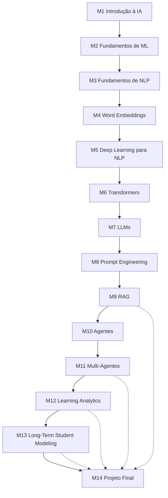
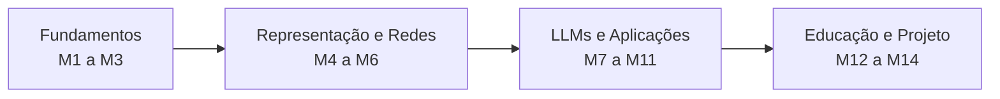

# Trilha de Aprendizagem

Esta é a trilha completa do repositório, organizada em 14 módulos que vão dos
fundamentos de IA até a construção de um assistente educacional multi-agente. A
ordem sugerida é sequencial, mas alguns módulos podem ser estudados de forma mais
independente, conforme o mapa de dependências abaixo.

## Mapa de dependências

## Níveis

Os módulos estão agrupados em quatro blocos de dificuldade crescente.

## Detalhamento dos módulos

### Módulo 1, Introdução à IA
Conceitos do que é IA, um panorama histórico e as três grandes correntes, que são
a IA simbólica, a IA estatística e a IA generativa. Serve para situar o aluno e
dar vocabulário para o restante da trilha.
Pré-requisitos: nenhum.

### Módulo 2, Fundamentos de Machine Learning
Regressão, classificação, a diferença entre overfitting e underfitting, e
estratégias de validação. É a base estatística sobre a qual o resto é construído.
Pré-requisitos: M1, mais noções de álgebra e estatística básica.

### Módulo 3, Fundamentos de NLP
Tokenização, stopwords, stemming, lemmatização, Bag of Words e TF-IDF. Mostra
como transformar texto em algo que um modelo consegue processar.
Pré-requisitos: M2.

### Módulo 4, Word Embeddings
Word2Vec, FastText, GloVe e Sentence Transformers. Como representar palavras e
frases em vetores densos que capturam significado.
Pré-requisitos: M3.

### Módulo 5, Deep Learning para NLP
Redes neurais, e as arquiteturas recorrentes RNN, LSTM e GRU. A ponte entre o NLP
clássico e os modelos modernos.
Pré-requisitos: M4.

### Módulo 6, Transformers
Self-attention, multi-head attention, encoder, decoder, e os modelos BERT e GPT.
O coração das arquiteturas atuais.
Pré-requisitos: M5.

### Módulo 7, Large Language Models
Como os LLMs funcionam, pré-treino, fine-tuning, ajuste por instrução e RLHF.
Pré-requisitos: M6.

### Módulo 8, Prompt Engineering
Zero-shot, few-shot, Chain of Thought e structured output. Como extrair o melhor
de um LLM sem treiná-lo de novo.
Pré-requisitos: M7.

### Módulo 9, Retrieval-Augmented Generation
Embeddings, vetores, ChromaDB, Qdrant e busca semântica.
Projeto: construir um assistente educacional baseado em documentos.
Pré-requisitos: M4 e M8.

### Módulo 10, Agentes
Tool calling, planning, memory, agent loops e LangGraph.
Projeto: criar um agente tutor.
Pré-requisitos: M9.

### Módulo 11, Multi-Agentes
Comunicação entre agentes, coordenação e especialização.
Projeto: criar um conjunto com Tutor Agent, Evaluator Agent, Mentor Agent e
Analytics Agent.
Pré-requisitos: M10.

### Módulo 12, Learning Analytics
Coleta de dados, métricas, engajamento e predição de evasão.
Projeto: um dashboard de aprendizado.
Pré-requisitos: M2 e M11.

### Módulo 13, Long-Term Student Modeling
Perfil do aluno, memória de longo prazo, modelagem cognitiva e personalização.
Projeto: um sistema adaptativo de aprendizagem.
Pré-requisitos: M12.

### Módulo 14, Projeto Final
Integração de tudo em um Multi-Agent Educational Assistant with Learning
Analytics and Long-Term Student Modeling.
Pré-requisitos: M9, M11, M12 e M13.

## Sugestão de ritmo

Para quem está começando, uma sugestão é um módulo por semana nos blocos iniciais
e duas semanas nos módulos com projeto, reservando tempo extra para o projeto
final. Esse ritmo é só uma referência e pode ser ajustado conforme a base prévia
de cada pessoa.
